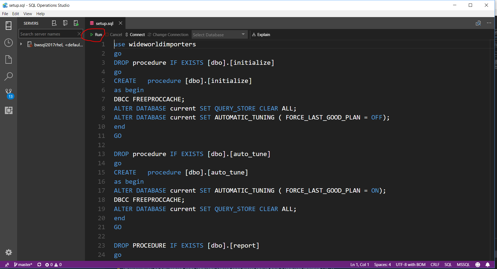
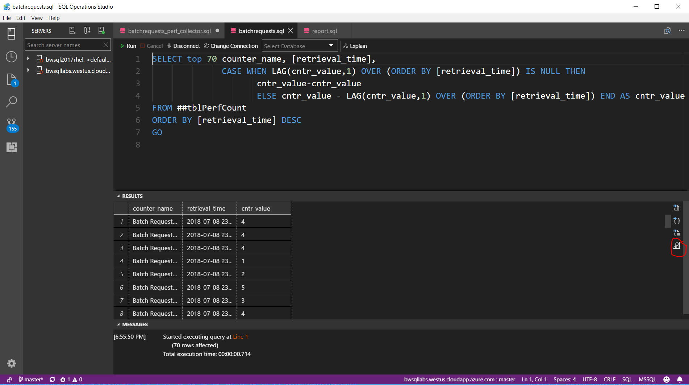
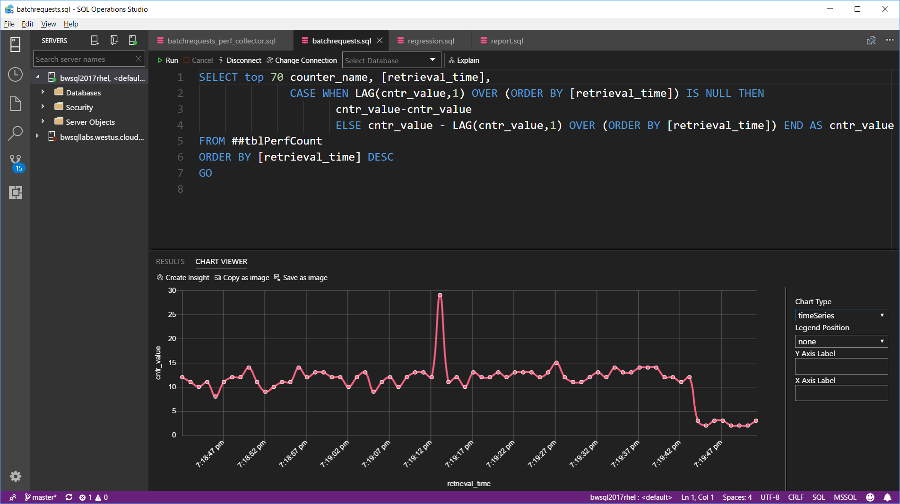
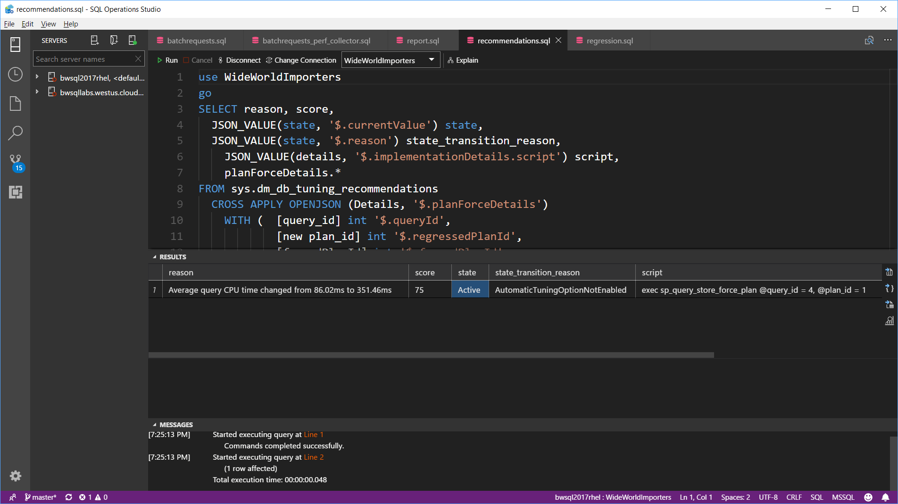
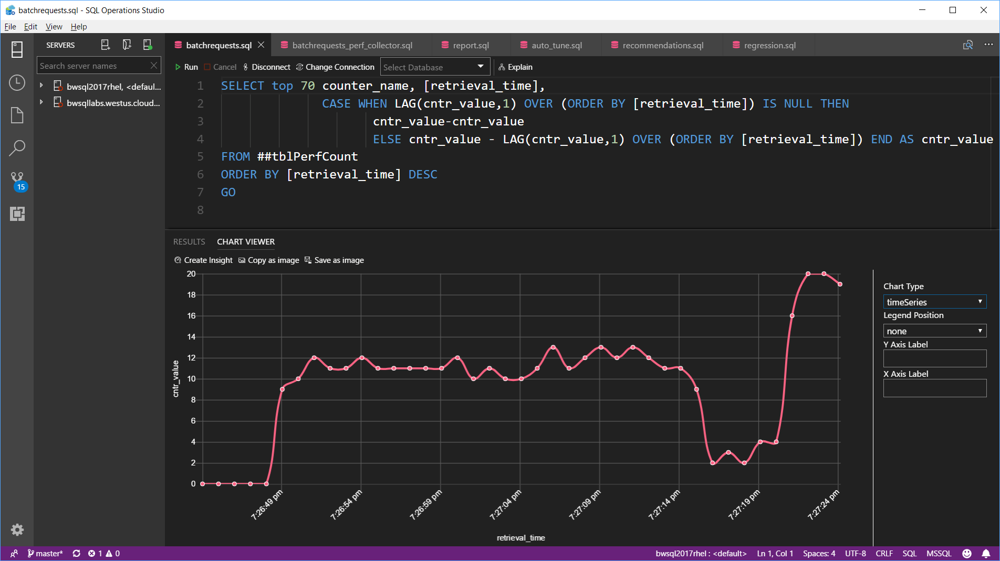
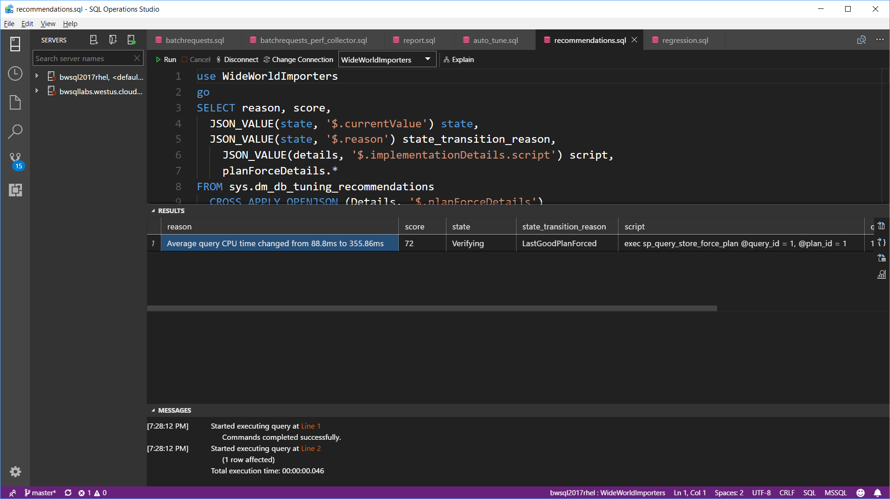

# Automatic Tuning and SQL Tooling Lab for SQL Server on Linux

This self-paced lab demonstrates the Automatic Tuning (Auto Plan Correction) feature of SQL Server on Linux. As part of this lab you will learn fundamentals of using SQL Operations Studio, which you should have installed as part of the prelab.

Automatic Tuning in SQL Server is a feature that uses the rich telemetry of Query Store to detect query plan regression issues. By default, if the Query Store is enabled for a database, SQL Server can detect query plan regression problems and provide recommendations through a Dynamic Management View. In addition, if the Automatic Tuning feature is enabled for a database, SQL Server can detect the query plan regression and correct it automatically by reverting to a previous "known good" plan.

You can watch a demonstration of this lab on YouTube at <https://www.youtube.com/watch?v=Sh8W7IFX390>

## Lab Setup

We will use the WideWorldImporters full sample database for this lab. If you have already restored this in the deploy_and_explore lab you can skip the Lab Setup section. **This lab assumes you have already installed SQL Server for Linux on RHEL (requires Developer or Enterprise Edition) and SQL Server command line tools**.
 
1. Connect with ssh to your Linux Server and run the following command to copy this database to your Linux Server

    `wget https://github.com/Microsoft/sql-server-samples/releases/download/wide-world-importers-v1.0/WideWorldImporters-Full.bak`

1. Depending on your network speed this should take no more than a few minutes

1. Copy and restore the WideWorldImporters database. Copy the **cpwwi.sh**, **restorewwi.sh**, and **restorewwi_linux.sql** files into your home directory on Linux. MobaXterm provides drag and drop capabilities to do this. Copy these files and drop them into the "explorer" pane in MobaXterm on the left hand side from your ssh session.

1. Run the following commands from the bash shell to make the bash shell scripts executable (supply the root password if prompted)
    
    `sudo chmod u+x cpwwi.sh`

    `sudo chmod u+x restorewwi.sh`
    
1. Copy the backup file to the SQL Server directory so it can access the file and change permissions on the backup file by executing the following command in the bash shell

    `./cpwwi.sh`

1. Now restore the database by executing the following command from the bash shell

    `./restorewwi.sh`

1. When this command completes successfully the output in your ssh session should look like the following

    

## Query Plan Regression Recommenations

Here is the scenario this lab is trying to demonstrate. When you execute a stored procedure in SQL Server, the engine can use a technique called parameter sniffing to compile a query plan based on parameter values of the stored procedure. If the value of the parameter from the procedure is used in a query comparing to a column that has skewed values, the query plan chosen when the query is compiled may not be optimal. 

This can result in a situation where the initial query plan is fine based on a value that is not skewed, but then an unexpected event could cause the plan to be evicted from cache (Ex. memory pressure) and a new plan could be compiled based on a parameter value that is skewed. And it is possible this new plan may not perform well for all users. If this problem occurs, it is considered a query plan regression. This is because a new query plan for the same query yields in poor performance vs previous version of the query plan.

For this lab, we will create a new stored procedure that will accept an integer parameter value and query tables in the WideWorldImporters database that may result in a query plan regression problem. For this section of the lab, we will execute T-SQL scripts in SQL Operations Studio

1. Use SQL Operations Studio to open up the file **setup.sql**. Use the File menu of SQL Operations Studio to select Open File... and find the setup.sql on your local drive where you have copied or cloned these labs.

2. Click on the Run button as seen from the screenshot below

    

3. You will be prompted with a connection screen to put in information about the Linux Server. Fill in the name of the Linux Server you have created for these labs. For Azure put in the complete hostname as you used for ssh connection (without the username). For example, bwsqllabs.westus.cloudapp.azure.com. Supply the sa login and password and check the Remember password option. This script creates a stored procedure called report and other procedures used to help automate pieces of the lab. You will use the same process to open up and execute remaining T-SQL scripts. And each tine you connect you can use a previous connect from Recent History.Once you have executed a script and select Remember Password, you will not have to reconnect.

    Examine the contents of setup.sql to see what these procedures do. Note that Query Store was enabled before the WideWorldImporters database sample was backed up. Close out this script when you are done.

4. Execute the T-SQL script **initialize.sql** to clear the query store. Once you execute this script, close out the window.

5. Open up the T-SQL script **batchrequests_perf_collector.sql** and examine it. In order to observe workload performance we need to monitor Batch Requests/Sec. But Windows Performance Monitor does not work with SQL Server on Linux. Therefore this script will collect Batch Requests/Sec from the DMV dm_os_performance_counters in a loop storing them in a global temporary table. This will effectively be our "perfmon" to query and find out workload throughput. Hold off executing this script.

6. Open up the script **batchrequests.sql**. This script will query the global temporary table. When we execut the script, we will be able to use the built-in charting capabilities of SQL Operations Studio to view the workload throughput in a chart (kind of like a static perfmon chart). Notice the results are produced in a format of counter, time, value. Hold off executing this script.

7. Open up the script **report.sql**. This script is the workload simulator running the report procedure in a loop of batches. Hold off executing this script.

8. Now run the T-SQL in the script batchrequests_perf_collector.sql and report.sql. Wait for about 20 seconds for these to execute before going to the next step.

9. Now execute the T-SQL in the script batchrequests.sql. Select the icon to the right to view as chart after the results are displayed (Note: Your numbers may look slightly different)

    

10. Select Chart Type and pick timeSeries. Your chart should show the throughput for Batch Requests/Sec. The numbers will vary but it should look something like the following (Notice the fairly consistent throughput from middle to right of the chart)

    

11. Now open up the script **regression.sql** and execute the T-SQL. This will run the regression procedure will will simulate a query plan regression problem. It will free the plan cache and then run the report procedure with a different parameter value. Note: The report.sql batch is running in a tight loop so you may have to run this 2-3 times to see the regression.

12. Run the script batchrequests.sql again and observe the chart. You should see a drop in performance like the following

    

13. Open up the script **recommendations.sql** and execute it. The results show a query plan regression has been detected. Note the values of columns

    The **reason** column shows the avg CPU increased by 4x for the same query with a new query plan. We choose CPU since overall duration could vary based on an event that is not a true plan regression (Ex. blocking or slow I/O)

    The **state_transition_reason** column shows that Automatic Tuning is not enabled.

    The **script** column shows a T-SQL statement you can run to resolve the issue by reverting to a previous plan where performance was good. 

    

14. Hit Cancel in the windows for batchrequests_perf_collector.sql and report.sql to stop these batches. **Note: We are chasing down an obscure bug with SQL Operations Studio where in some cases these quereis cannot be cancelled after running for a certain period of time. If this occurs, exit and restart SQL Operations Studio to go to the next steps in the lab.**

You now have observed how with Query Store enabled SQL Server can detect and recommend query plan regression problems. You also have recommendations on how to resolve the problem yourself manually.

## Automatic Tuning in Action

In this section of the lab, we will see the same type of query plan regression behavior as before except this time with Automatic Tuning enabled, SQL Server will automatically resolve the problem.

**Note: Do not run setup.sql or initialize.sql again for this part of the lab.**

1. Open up and execute the script **auto_tune.sql**. This is like initialize.sql except it enables automatic tuning. Close out this script

2. All the other scripts should still be open in SQL Operation Studio. You will go through the same steps as you did above starting with **step 8** in the previous section. Except, after running regression.sql, wait for a few seconds before running batchrequests.sql to see how SQL Server will automatically resolve the regression. In fact, the performance of the workload may go up slightly since the plan is being forced (not a guarantee in all cases).

3. If SQL Server has corrected the problem, the chart from batchrequests.sql should look something like this

    

4. Run recommendations.sql again and see the results. They should be similar except the state_transition_reason now says LastGoodPlanForced indicating SQL Server has automatically corrected the query plan regressino problem

    

You have seen that by default if Query Store is enabled, SQL Server can pinpoint and recommend query plan regression performance problems. Then, if you are comfortable, you can enable automatic tuning and let SQL Server correct these types of problems automatically.
